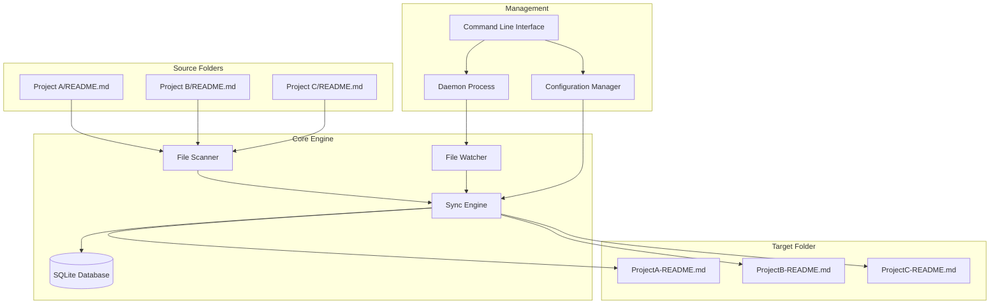

# README Sync Manager



A powerful tool for centralizing and synchronizing README.md files from multiple projects with intelligent mapping and real-time monitoring.

## Features

- **Multi-source scanning**: Recursively search for README.md files across multiple project directories
- **Smart project name extraction**: Intelligent project categorization with sibling directory detection
- **Bidirectional synchronization**: Sync from source to target and vice versa with conflict resolution
- **Dynamic file mapping**: Target files can be moved to subfolders while maintaining sync relationships
- **Real-time monitoring**: File system watching with configurable sync intervals (down to 1 second)
- **Persistent state management**: SQLite database stores file mappings and metadata
- **Daemon process support**: Background service with system integration
- **Auto-start capabilities**: System service integration for automatic startup
- **Comprehensive CLI**: Rich command-line interface for all operations

## Installation

### Development Installation
```bash
git clone https://github.com/APE-147/readme-flat.git
cd readme-flat
pip install -e .
```

### Usage via Python Module
```bash
# Run from project directory
python -m src.readme_sync.cli --help
```

## Quick Start

```bash
# Initialize configuration
python -m src.readme_sync.cli init

# Add source folders
python -m src.readme_sync.cli add-source ~/Developer/Projects
python -m src.readme_sync.cli add-source ~/Code/Repositories

# Set target folder
python -m src.readme_sync.cli set-target ~/Documents/README-Collection

# Manual sync
python -m src.readme_sync.cli sync

# Start daemon for continuous monitoring
python -m src.readme_sync.cli daemon start

# Check status
python -m src.readme_sync.cli status
```

## Command Reference

### Basic Operations
- `init`: Initialize configuration file with interactive setup
- `add-source <path>`: Add source folder for README scanning
- `remove-source <path>`: Remove source folder
- `set-target <path>`: Set target folder for centralized READMEs
- `sync`: Execute manual synchronization
- `status`: View comprehensive sync status

### Configuration Management
- `config list`: Display current configuration
- `config get <key>`: Get specific configuration value
- `config set <key> <value>`: Set configuration value

### Daemon Process
- `daemon start`: Start background daemon process
- `daemon stop`: Stop daemon process
- `daemon restart`: Restart daemon process
- `daemon status`: View daemon status and metrics
- `daemon logs [-n lines] [-f]`: View daemon logs

### Real-time Monitoring
- `watch [--interval seconds]`: Start file monitoring (foreground)
- `realtime start`: Start real-time sync (foreground)
- `realtime status`: View real-time sync status

### System Integration
- `autostart install`: Install system auto-start service
- `autostart uninstall`: Remove auto-start service
- `autostart status`: Check auto-start status

### Maintenance
- `scan`: Scan and display found README files
- `cleanup`: Clean orphaned database mappings

## Configuration

Configuration file location: `~/.readme-sync/config.yaml`

```yaml
version: "1.0"
source_folders:
  - path: "~/Developer/Projects"
    enabled: true
  - path: "~/Code/Repositories"
    enabled: true

target_folder: "~/Documents/README-Collection"

sync_settings:
  conflict_resolution: "latest"        # latest, manual, source_priority, target_priority
  tolerance_seconds: 5                 # Time tolerance for conflict detection
  auto_sync_interval: 1                # Auto-sync interval in seconds

naming_rules:
  pattern: "{project_name}-README"     # File naming pattern
  case_style: "keep"                   # keep, lower, upper

exclusions:
  - "node_modules"
  - ".git"
  - "venv"
  - "__pycache__"
  - ".DS_Store"
  - "*.tmp"
  - "*.log"
```

## Project Structure

```
readme-flat/
├── src/readme_sync/
│   ├── __init__.py          # Package initialization
│   ├── cli.py               # Command-line interface
│   ├── config.py            # Configuration management
│   ├── database.py          # SQLite database operations
│   ├── scanner.py           # File scanning and project detection
│   ├── sync_engine.py       # Core synchronization logic
│   ├── watcher.py           # Real-time file monitoring
│   ├── daemon.py            # Background daemon process
│   ├── autostart.py         # System service integration
│   └── utils.py             # Utility functions
├── requirements.txt         # Python dependencies
├── setup.py                # Package setup configuration
└── README.md               # This file
```

## Key Features Explained

### Intelligent Project Name Extraction
The system uses sophisticated logic to extract meaningful project names:
- Analyzes directory structure and sibling directories
- Handles project categorization (e.g., Script/, Crawler/, Trading/)
- Avoids common code directory names while preserving meaningful categories

### Bidirectional Synchronization
- **Source → Target**: Copy README files from project directories to centralized location
- **Target → Source**: Sync changes back to original project locations
- **Conflict Resolution**: Configurable strategies for handling conflicts

### Real-time Monitoring
- File system event-driven synchronization
- Configurable sync intervals (1 second minimum)
- Intelligent duplicate detection and prevention

### Database Persistence
- SQLite database stores file mappings and metadata
- Hash-based content verification
- Orphaned mapping cleanup utilities

## System Requirements

- Python 3.8+
- macOS, Linux, or Windows
- Required packages: click, pyyaml, watchdog, psutil

## License

This project is open source. See the repository for license details.
