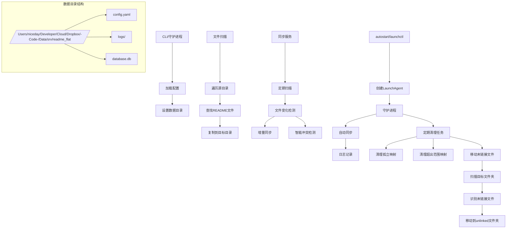
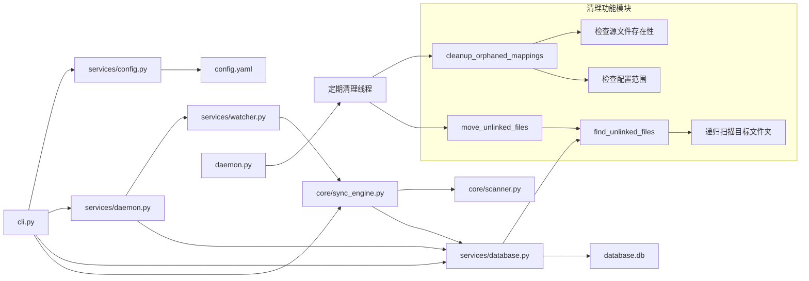
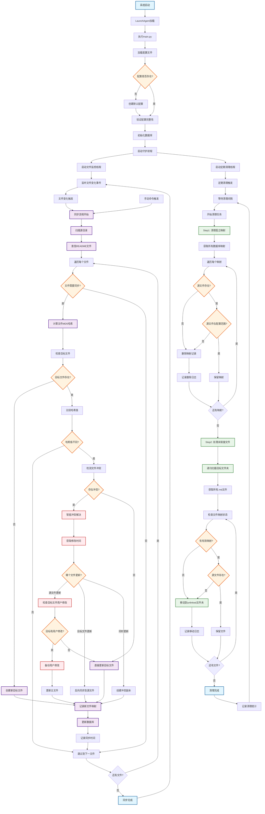

# README Sync Manager - 集中管理项目README文件

## 项目概述
README Sync Manager 是一个用于集中管理和同步多个项目 README 文件的工具。它可以自动扫描指定目录下的所有 README 文件，并将它们同步到一个集中的目标目录，便于在 Obsidian 等知识管理工具中统一查看和编辑。

## 主要功能

- 📁 **自动扫描**: 自动扫描配置的源目录，查找所有 README 文件
- 🔄 **双向同步**: 支持从源到目标和从目标到源的双向同步
- 🛡️ **智能同步**: 检测文件修改，仅同步有变化的文件
- 🔍 **实时监控**: 使用 watchdog 实时监控文件变化
- 🧹 **定期清理**: 自动清理不存在的源文件映射和未链接文件
- 📂 **未链接文件管理**: 自动检测并移动未链接的 README 文件到指定子文件夹
- 🗑️ **超范围映射清理**: 自动清理超出配置源文件夹范围的数据库映射
- 🚀 **守护进程**: 支持后台运行，开机自启动
- 💾 **数据持久化**: 使用 SQLite 数据库记录文件映射关系
- ⚡ **防循环同步**: 内置防循环机制，避免同步死循环
- 🎯 **智能冲突解决**: 自动检测并处理文件冲突，优先保护用户修改

## 功能实现原理



## 文件引用关系



## 功能实现运行流程



## 安装与部署

### 1. 安装项目
```bash
# 克隆或下载项目到指定目录
cd ~/Developer/Code/Scripts/desktop/readme-flat

# 安装依赖（使用 pip 或 conda）
pip install -e .
```

### 2. 初始化配置
```bash
# 初始化配置文件
readme-sync init

# 添加源目录
readme-sync add-source ~/Developer/Code/Scripts

# 设置目标目录
readme-sync set-target ~/Developer/Code/Data/file/APP/Obsidian/Remote-temp/[readme]
```

### 3. 配置定期清理（新功能）
```bash
# 查看当前清理间隔
readme-sync config cleanup-interval

# 设置清理间隔（单位：秒，最小60秒）
readme-sync config cleanup-interval 3600  # 设置为1小时
```

### 4. 启动服务
```bash
# 启动守护进程
readme-sync daemon start

# 查看守护进程状态
readme-sync daemon status

# 停止守护进程
readme-sync daemon stop
```

## 使用说明

### 基本命令
```bash
# 手动执行同步
readme-sync sync

# 查看同步状态
readme-sync status

# 扫描并显示README文件
readme-sync scan

# 手动清理孤立映射
readme-sync cleanup

# 智能同步（反向同步Obsidian中的修改）
readme-sync smart-sync

# 未链接文件管理（新功能）
readme-sync list-unlinked    # 列出未链接文件
readme-sync move-unlinked    # 移动未链接文件到子文件夹
```

### 配置管理
```bash
# 查看所有配置
readme-sync config list

# 获取特定配置项
readme-sync config get sync_settings.cleanup_interval

# 设置配置项
readme-sync config set sync_settings.tolerance_seconds 10
```

### 守护进程管理
```bash
# 查看守护进程日志
readme-sync daemon logs

# 前台运行（调试模式）
readme-sync daemon start -f
```

## 定期清理功能

### 功能说明
守护进程会根据配置的间隔自动执行以下清理任务：

1. **清理孤立映射**: 删除源文件已不存在的数据库映射记录
2. **清理超范围映射**: 删除不在当前配置源文件夹范围内的映射记录
3. **移动未链接文件**: 将目标文件夹中未被跟踪的 README 文件移动到 `unlinked` 子文件夹

### 默认设置
- 默认清理间隔：3600秒（1小时）
- 最小间隔：60秒
- 未链接文件夹名称：`unlinked`
- 移动未链接文件：默认启用

### 配置方法
```bash
# 设置清理间隔
readme-sync config cleanup-interval 1800  # 30分钟
readme-sync config cleanup-interval 7200  # 2小时

# 启用/禁用未链接文件移动
readme-sync config set sync_settings.move_unlinked_files true   # 启用
readme-sync config set sync_settings.move_unlinked_files false  # 禁用

# 设置未链接文件夹名称
readme-sync config set sync_settings.unlinked_subfolder "archive"

# 重启守护进程以应用新设置
readme-sync daemon restart
```

## 未链接文件管理

### 功能说明
系统会自动检测目标文件夹中没有对应源文件映射的 README 文件，并提供管理功能：

1. **列出未链接文件**: 显示所有未被跟踪的文件
2. **手动移动**: 立即移动未链接文件到子文件夹
3. **自动移动**: 守护进程定期自动移动未链接文件

### 使用方法
```bash
# 列出所有未链接文件
readme-sync list-unlinked

# 手动移动未链接文件
readme-sync move-unlinked

# 通过守护进程自动移动（默认已启用）
# 守护进程会在每次清理周期自动执行
```

### 未链接文件类型
- 手动添加到目标文件夹的 README 文件
- 源文件已删除但目标文件仍存在的情况
- 从其他来源复制的 README 文件

## 数据目录结构

```
/Users/niceday/Developer/Cloud/Dropbox/-Code-/Data/srv/readme_flat/
├── config.yaml          # 主配置文件（集中管理所有路径设置）
├── database.db          # 文件映射数据库
├── daemon.pid           # 守护进程PID
├── daemon.status        # 守护进程状态
├── daemon.log           # 守护进程日志
├── launchd.out          # LaunchAgent 标准输出（如启用）
├── launchd.err          # LaunchAgent 错误输出（如启用）
└── logs/                # 其他日志文件
```

## 安装与部署

- 安装依赖
  ```bash
  pip install -e .[dev]
  ```
- 初始化与配置
  ```bash
  readme-sync init
  readme-sync add-source /path/to/src1
  readme-sync set-target /path/to/target
  # 或直接编辑固定配置文件：
  # /Users/niceday/Developer/Cloud/Dropbox/-Code-/Data/srv/readme_flat/config.yaml
  ```
- 启动/停止/清理
  ```bash
  readme-sync daemon start          # 后台运行（加 -f 前台调试）
  readme-sync daemon status         # 查看状态
  readme-sync daemon stop           # 停止并清理 pid/status/log
  readme-sync daemon clean          # 额外清理 launchd.out/err 等残留
  ```
- 开机自启动（macOS）
  ```bash
  readme-sync autostart             # 交互安装/卸载 LaunchAgent
  ```

说明：不再使用 PROJECT_DATA_DIR 和 scan_folders.json；所有路径设置集中于上述 config.yaml。支持通过 n8n 或脚本以“运行时覆盖”的方式临时传入源/目标路径（不写回文件）。

## 反向写回（目标 → 源）
- 集成于 `sync`：执行正向同步后，会自动进行一轮反向扫描；当“目标文件比源文件新且内容不同（超过容忍秒数）”时，将修改写回源文件。
- 仅反向模式：使用 runner：
  ```bash
  # 从目标扫描写回到源
  python scripts/n8n_runner.py --mode reverse --config /Users/niceday/Developer/Cloud/Dropbox/-Code-/Data/srv/readme_flat/config.yaml --args-file /tmp/args.json
  
  # 强制写回（只要内容不同就写回）
  READMESYNC_FORCE=true python scripts/n8n_runner.py --mode reverse --config /Users/niceday/Developer/Cloud/Dropbox/-Code-/Data/srv/readme_flat/config.yaml --args-file /tmp/args.json
  ```
- 并发安全：反向路径引入与正向一致的 per-file 锁，避免正反向竞争。

## 在 n8n 中使用（Option A）
- 通过 Execute Command 写入 /tmp/args.json：
  ```bash
  =printf '%s' '{{ $json.json.argsJson }}' > /tmp/args.json
  ```
- 同步（含写回）：
  ```bash
  python scripts/n8n_runner.py --mode sync --config /Users/niceday/Developer/Cloud/Dropbox/-Code-/Data/srv/readme_flat/config.yaml --args-file /tmp/args.json
  ```
- 仅写回：
  ```bash
  python scripts/n8n_runner.py --mode reverse --config /Users/niceday/Developer/Cloud/Dropbox/-Code-/Data/srv/readme_flat/config.yaml --args-file /tmp/args.json
  ```
- 清理与重置：
  ```bash
  python scripts/n8n_runner.py --mode clean  --config ... --args-file /tmp/args.json
  python scripts/n8n_runner.py --mode reset  --config ... --args-file /tmp/args.json
  ```

## 注意事项

1. **防止循环同步**: 系统内置了防循环机制，同一文件在5秒内不会被重复同步
2. **冲突处理**: 当检测到文件冲突时，会生成带时间戳的冲突文件
3. **智能同步**: 使用 `smart-sync` 可以安全地将 Obsidian 中的修改同步回源文件
4. **定期清理**: 守护进程会自动清理孤立映射，保持数据库整洁
5. **性能优化**: 使用 MD5 哈希值比较，只同步真正有变化的文件
