# README Sync Manager

```mermaid
graph TB
    subgraph "Source Projects"
        S1[Project A/README.md]
        S2[Project B/README.md]
        S3[Project C/README.md]
    end
    
    subgraph "Intelligent Sync Engine"
        Scanner[File Scanner<br/>智能项目检测]
        SyncEngine[Bidirectional Sync<br/>双向同步引擎]
        DB[(SQLite Database<br/>文件映射与状态)]
        Watcher[Real-time Monitor<br/>实时文件监控]
        Lock[Anti-Loop System<br/>防循环机制]
    end
    
    subgraph "Target Collection (Obsidian)"
        T1[ProjectA-README.md]
        T2[ProjectB-README.md] 
        T3[ProjectC-README.md]
        Obsidian[📝 Obsidian Vault<br/>用户编辑环境]
    end
    
    subgraph "Management Interface"
        CLI[Command Line<br/>命令行界面]
        Daemon[Background Daemon<br/>后台守护进程]
        Config[Configuration<br/>配置管理]
    end
    
    S1 -.->|扫描发现| Scanner
    S2 -.->|扫描发现| Scanner
    S3 -.->|扫描发现| Scanner
    
    Scanner --> SyncEngine
    SyncEngine <--> DB
    SyncEngine -->|正向同步| T1
    SyncEngine -->|正向同步| T2
    SyncEngine -->|正向同步| T3
    
    T1 -->|反向同步| SyncEngine
    T2 -->|反向同步| SyncEngine
    T3 -->|反向同步| SyncEngine
    
    Obsidian <--> T1
    Obsidian <--> T2
    Obsidian <--> T3
    
    Watcher -->|文件变化检测| SyncEngine
    Lock -->|防止循环同步| SyncEngine
    CLI --> Config
    CLI --> Daemon
    Config --> SyncEngine
    Daemon --> Watcher
    
    style SyncEngine fill:#e1f5fe
    style Lock fill:#fff3e0
    style Obsidian fill:#f3e5f5
```



A powerful **bidirectional README synchronization tool** designed for developers who want to centralize project documentation while maintaining seamless editing capabilities in tools like Obsidian. Features intelligent conflict resolution and anti-loop mechanisms to prevent sync conflicts.

## ✨ Key Features

### 🔄 **Intelligent Bidirectional Sync**
- **Source → Target**: Automatically sync README files from projects to centralized location
- **Target → Source**: Sync user edits back to original project locations
- **Anti-Loop Protection**: Advanced mechanisms prevent infinite sync loops
- **Conflict Resolution**: Smart handling of simultaneous modifications

### 🧠 **Smart Project Detection**
- **Multi-source scanning**: Recursively discover README.md files across project directories
- **Intelligent naming**: Extract meaningful project names with category detection
- **Dynamic mapping**: Files can be reorganized while maintaining sync relationships
- **Sibling detection**: Understands project structure and categorization

### ⚡ **Real-time Monitoring**
- **File system watching**: Instant detection of README changes
- **Configurable intervals**: Sync frequency from 1 second to hours
- **Debounce protection**: Prevents excessive sync operations
- **Time-window filtering**: 3-second cooldown prevents rapid-fire syncing

### 🛡️ **User Edit Protection**
- **Obsidian-friendly**: Designed specifically for Obsidian vault integration
- **Edit preservation**: User modifications in target location are respected
- **Timestamp-based decisions**: Latest modification always wins
- **Manual override capabilities**: Force sync when needed

### 🎛️ **Advanced Management**
- **Background daemon**: Silent operation with system service integration
- **Comprehensive CLI**: Rich command-line interface for all operations
- **Persistent state**: SQLite database stores mappings and metadata
- **Auto-start support**: System integration for automatic startup
- **Health monitoring**: Status tracking and performance metrics

## Installation

### Development Installation
```bash
git clone https://github.com/APE-147/readme-flat.git
cd readme-flat
pip install -e .
```

### Usage via Python Module
```bash
# Run from project directory
python -m src.readme_sync.cli --help
```

## Quick Start

```bash
# Initialize configuration
python -m src.readme_sync.cli init

# Add source folders
python -m src.readme_sync.cli add-source ~/Developer/Projects
python -m src.readme_sync.cli add-source ~/Code/Repositories

# Set target folder
python -m src.readme_sync.cli set-target ~/Documents/README-Collection

# Manual sync
python -m src.readme_sync.cli sync

# Start daemon for continuous monitoring
python -m src.readme_sync.cli daemon start

# Check status
python -m src.readme_sync.cli status
```

## Command Reference

### Basic Operations
- `init`: Initialize configuration file with interactive setup
- `add-source <path>`: Add source folder for README scanning
- `remove-source <path>`: Remove source folder
- `set-target <path>`: Set target folder for centralized READMEs
- `sync`: Execute manual synchronization
- `status`: View comprehensive sync status

### Configuration Management
- `config list`: Display current configuration
- `config get <key>`: Get specific configuration value
- `config set <key> <value>`: Set configuration value

### Daemon Process
- `daemon start`: Start background daemon process
- `daemon stop`: Stop daemon process
- `daemon restart`: Restart daemon process
- `daemon status`: View daemon status and metrics
- `daemon logs [-n lines] [-f]`: View daemon logs

### Conflict Management & Advanced Sync
- `smart-sync [--dry-run]`: Intelligent sync with user edit protection
- `conflicts list`: Show files with sync conflicts
- `conflicts resolve <file>`: Manually resolve specific conflicts
- `reverse-sync [--force]`: Force target-to-source synchronization

### Real-time Monitoring
- `watch [--interval seconds]`: Start file monitoring (foreground)
- `realtime start`: Start real-time sync (foreground)
- `realtime status`: View real-time sync status

### System Integration
- `autostart install`: Install system auto-start service
- `autostart uninstall`: Remove auto-start service
- `autostart status`: Check auto-start status

### Maintenance
- `scan`: Scan and display found README files
- `cleanup`: Clean orphaned database mappings

## Configuration

Configuration file location: `~/.readme-sync/config.yaml`

```yaml
version: "1.0"
source_folders:
  - path: "~/Developer/Projects"
    enabled: true
  - path: "~/Code/Repositories"
    enabled: true

target_folder: "~/Documents/README-Collection"

sync_settings:
  conflict_resolution: "latest"        # latest, manual, source_priority, target_priority
  tolerance_seconds: 5                 # Time tolerance for conflict detection
  auto_sync_interval: 1                # Auto-sync interval in seconds
  sync_cooldown: 3                     # Anti-loop cooldown period in seconds
  enable_bidirectional: true           # Enable bidirectional synchronization

naming_rules:
  pattern: "{project_name}-README"     # File naming pattern
  case_style: "keep"                   # keep, lower, upper

exclusions:
  - "node_modules"
  - ".git"
  - "venv"
  - "__pycache__"
  - ".DS_Store"
  - "*.tmp"
  - "*.log"
```

## Project Structure

```
readme-flat/
├── src/readme_sync/
│   ├── __init__.py          # Package initialization
│   ├── cli.py               # Command-line interface
│   ├── config.py            # Configuration management
│   ├── database.py          # SQLite database operations
│   ├── scanner.py           # File scanning and project detection
│   ├── sync_engine.py       # Core synchronization logic
│   ├── watcher.py           # Real-time file monitoring
│   ├── daemon.py            # Background daemon process
│   ├── autostart.py         # System service integration
│   └── utils.py             # Utility functions
├── requirements.txt         # Python dependencies
├── setup.py                # Package setup configuration
└── README.md               # This file
```

## Key Features Explained

### Intelligent Project Name Extraction
The system uses sophisticated logic to extract meaningful project names:
- Analyzes directory structure and sibling directories
- Handles project categorization (e.g., Script/, Crawler/, Trading/)
- Avoids common code directory names while preserving meaningful categories

### 🔄 Bidirectional Synchronization with Anti-Loop Protection
- **Source → Target**: Copy README files from project directories to centralized location  
- **Target → Source**: Sync user edits back to original project locations
- **Anti-Loop Mechanisms**: 
  - Sync state locks prevent concurrent operations on same files
  - 3-second cooldown period prevents rapid-fire syncing
  - Time-window filtering detects and blocks circular sync patterns
- **Conflict Resolution**: Timestamp-based intelligent conflict resolution
- **User Edit Protection**: Obsidian modifications are preserved and respected

### ⚡ Enhanced Real-time Monitoring
- **Event-driven sync**: Instant response to file system changes
- **Debounce protection**: 2-second debounce prevents excessive operations  
- **Smart filtering**: Ignores temporary files and system-generated changes
- **Performance optimization**: Configurable sync intervals (1 second minimum)
- **Health monitoring**: Track sync performance and detect anomalies

### Database Persistence
- SQLite database stores file mappings and metadata
- Hash-based content verification
- Orphaned mapping cleanup utilities

## 🛠️ System Requirements

- **Python**: 3.8+ (recommended: 3.9+)
- **Operating Systems**: macOS, Linux, Windows
- **Dependencies**: 
  - `click` - Command-line interface framework
  - `pyyaml` - Configuration file parsing
  - `watchdog` - File system monitoring
  - `psutil` - Process and system utilities
- **Storage**: ~10MB for installation, variable for database (typically <1MB per 1000 files)

## 🚀 Performance & Reliability

### Anti-Loop Technology
- **Sync State Locks**: Prevent concurrent operations on same files
- **Time-Window Filtering**: 3-second cooldown prevents rapid-fire syncing  
- **Circular Pattern Detection**: Identifies and breaks sync loops automatically
- **Memory Efficient**: Cleanup mechanisms prevent memory leaks during long-running operations

### Obsidian Integration
- **Vault-Friendly**: Designed specifically for Obsidian workflow integration
- **Edit Preservation**: User modifications are detected and preserved
- **Real-time Sync**: Changes in Obsidian immediately sync back to source projects
- **No File Conflicts**: Intelligent timestamp-based resolution

### Production Ready
- **Background Daemon**: Silent operation with minimal resource usage
- **Error Recovery**: Robust error handling and automatic recovery
- **Monitoring**: Built-in health checks and performance metrics
- **Logging**: Comprehensive logging for troubleshooting and monitoring

## 🤝 Contributing

This project welcomes contributions! Whether it's bug reports, feature requests, or code contributions, please feel free to get involved.

## 📄 License

This project is open source. See the repository for license details.

---

**Last Updated**: July 11, 2025 - Added comprehensive anti-loop protection and enhanced bidirectional sync capabilities.
